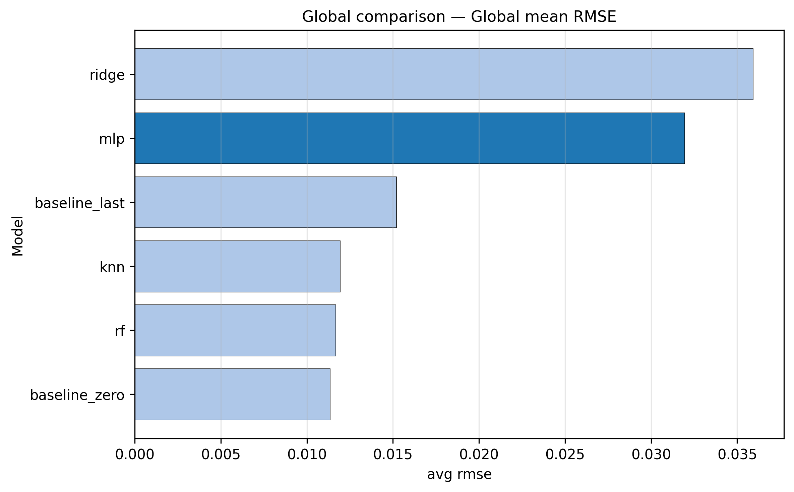
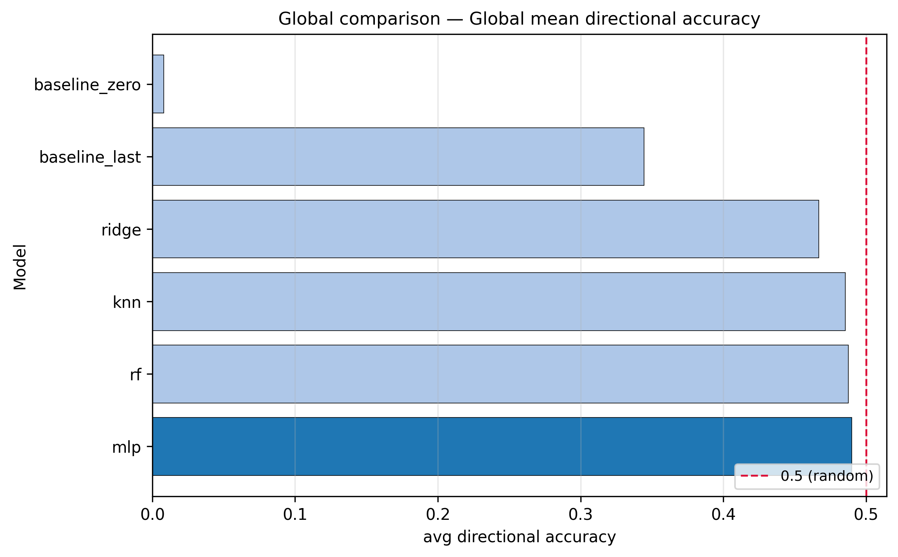
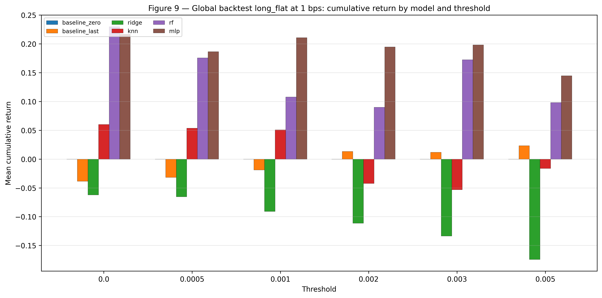
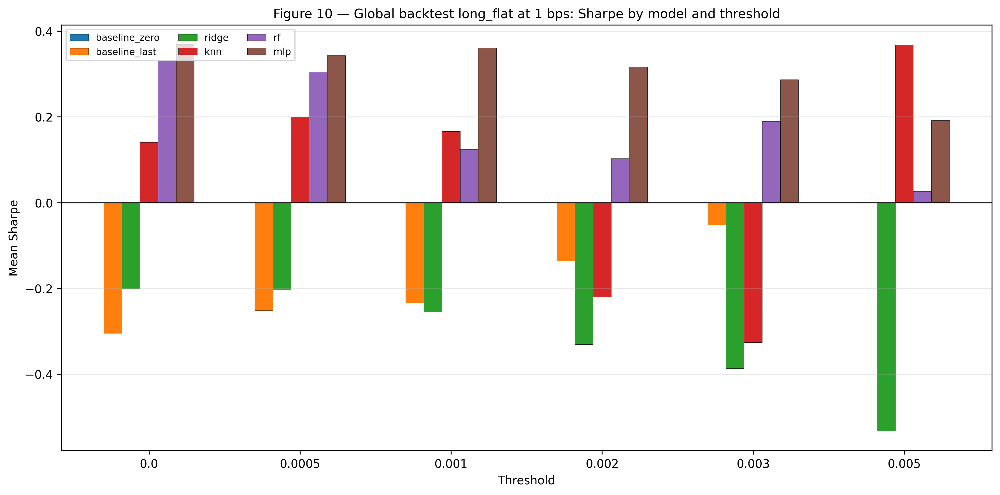

# Macro News → US Market Returns | PyTorch MLP Pipeline

**Research-grade ML pipeline** that links daily US macro news features to next-day returns on 15 ETFs and BTC, with a **PyTorch MLP** at the centre, rigorous baselines, walk-forward evaluation, cost-aware backtesting, and automated model selection.

> Portfolio project in applied ML / quantitative research — reproducible code, honest metrics, no production claims.

---

## Problem & Motivation

Financial markets react to news, but the relationship is **noisy, non-stationary, and easy to overfit**. A naive “predict tomorrow’s return from today’s headlines” model can look good on paper while failing on simple baselines or leaking information from the future.

This project asks a focused question:

**Can daily aggregated news signals improve next-day return forecasts compared to strong baselines, under proper time-ordered evaluation?**

The emphasis is on **methodology**: multi-target design, leakage-aware folds, threshold backtests, and transparent reporting — not on claiming trading alpha.

---

## What This Project Does

| Stage | Output |
|-------|--------|
| **Ingest** | GDELT-style news CSV + Yahoo Finance daily prices |
| **Feature engineering** | Daily tone stats, hashed themes/orgs, article counts |
| **Dataset** | `ml_dataset.parquet` with 15 `y_*` next-day return targets |
| **Modelling** | 6 model families including PyTorch **MLP** |
| **Evaluation** | Expanding walk-forward metrics (MAE, RMSE, R², directional accuracy, correlations) |
| **Backtest** | Long-flat / long-short rules with bps costs and confidence thresholds |
| **Selection** | Global or per-target best model + threshold by Sharpe |

One command runs the full chain after the dataset is built:

```bash
python -m news_impact.run_all --data data/processed/ml_dataset.parquet
```

---

## Key Features

- **Multi-target regression** — 15 assets: UUP, TLT, GLD, BTC-USD, and US sector ETFs (XLK … XLC).
- **PyTorch MLP** — 256-unit hidden layers, dropout, early stopping; preprocessing fit **per fold only**.
- **Strong baselines** — zero return, last return, kNN “similar days”, Ridge, Random Forest.
- **Walk-forward evaluation** — no random shuffle; configurable train start, step, and test window.
- **Rich metrics** — per-target and global averages; leaderboard CSVs committed under `reports/metrics/`.
- **Threshold backtests** — sweep prediction confidence before taking positions.
- **Model selection** — `select_setup` exports `final_selection_global.csv` / `final_selection_per_target.csv`.
- **Report figures** — auto-generated via `generate_report_figures` (see [Selected figures](#selected-figures)).

---

## Technical Stack

| Layer | Technology |
|-------|------------|
| Language | Python 3.10+ |
| Deep learning | **PyTorch** (MLP regressor) |
| Classical ML | scikit-learn (kNN, Ridge, RF, imputation, scaling) |
| Data | pandas, NumPy, Parquet |
| News parsing | Custom GDELT helpers (`V2Tone`, themes, organisations) |
| Markets | yfinance (user-exported CSV) |
| Viz | matplotlib (plots + report figures) |
| Packaging | `pyproject.toml`, `pip install -e .` |

---

## End-to-End Pipeline

```
data/raw/dataset.csv  ──┐
data/raw/market_data.csv┼──► prepare_dataset ──► ml_dataset.parquet
                        │
                        ├──► train (6 models) ──────────► models/<name>/
                        ├──► evaluate (walk-forward) ───► reports/metrics/
                        ├──► backtest + thresholds ─────► reports/metrics/backtest_*.csv
                        └──► select_setup ──────────────► reports/selection/
```

**Module map**

| CLI module | Role |
|------------|------|
| `news_impact.prepare_dataset` | Merge news + market → Parquet |
| `news_impact.train` | Fit one model family |
| `news_impact.evaluate` | Walk-forward metrics + plots |
| `news_impact.run_all` | Orchestrate train → eval → backtest → selection |
| `news_impact.backtest` | Strategy simulation + threshold grid |
| `news_impact.select_setup` | Pick final operational setup |
| `news_impact.predict` | Inference from saved model or selection file |
| `news_impact.generate_report_figures` | Build all `reports/figures_for_report/` PNGs |

---

## Repository Structure

```
news_impact_nn_project/
├── src/news_impact/           # Pipeline source code
│   ├── prepare_dataset.py
│   ├── modeling.py            # MLPRegressor (PyTorch)
│   ├── train.py / evaluate.py
│   ├── run_all.py
│   ├── backtest.py
│   └── select_setup.py
├── assets/                    # README figures (subset of report output)
├── data/raw/                  # User inputs (gitignored)
├── data/processed/            # ml_dataset.parquet (gitignored)
├── models/                    # Trained weights (gitignored)
├── reports/
│   ├── metrics/               # CSV results (in repo)
│   ├── selection/             # Final setups (in repo)
│   ├── summary.md             # Auto-generated run summary
│   └── figures_for_report/    # Full figure set (gitignored; regenerate locally)
├── requirements.txt
└── pyproject.toml
```

---

## Methodology

### Data preparation

1. **News** — parse GDELT export: daily aggregates of tone (pos/neg/polarity), article count, hashed theme and organisation features (`FeatureHasher`, 256 dims each).
2. **Market** — align daily prices; compute **next-day returns** for each ticker.
3. **Merge** — inner join on calendar date; drop rows with missing targets where needed.
4. **Output** — `data/processed/ml_dataset.parquet` (~1.8k rows, 543 columns in the reference run).

Raw CSVs are **not** in the repository (see [How to run](#how-to-run)).

### ANN / MLP training

The main neural model is a **feed-forward MLP** in PyTorch (`modeling.py`): input → Linear(256) → ReLU → Dropout → Linear(256) → ReLU → Dropout → multi-output head.

Reference hyperparameters (`models/mlp/manifest.json`): hidden **256**, dropout **0.1**, lr **0.001**, batch **256**, up to **25** epochs with patience **8**. Features are imputed (median) and scaled **inside each training split only**.

### Walk-forward evaluation

- Time-ordered splits; **no shuffle**.
- Default quick mode: `wf_start=0.70`, `wf_step=20`, `wf_test_window=60`.
- Each fold **retrains** models; artefacts are not reused across folds inside `evaluate`.
- Metrics aggregated globally and per target; outputs in `reports/metrics/`.

### Backtesting

- Converts predictions into **long-flat** or **long-short** positions.
- Default transaction cost: **1 bps** per position change.
- Reports cumulative return, Sharpe, hit rate, and active rate by model/threshold.

### Threshold testing

- Grid over confidence cut-offs (e.g. `0, 0.0005, 0.001, 0.002, 0.003, 0.005`).
- Identifies whether filtering weak signals improves Sharpe vs threshold = 0.
- Results: `reports/metrics/backtest_threshold_sweep.csv`, `backtest_threshold_best.csv`.

### Model selection

- `select_setup` ranks combinations by **Sharpe** (or cumulative return) at a given cost.
- Supports **global** (one model for all targets) or **per-target** (best model per asset).
- Exports `reports/selection/final_selection_*.csv` and `recommended_setups.csv`.

---

## Results Summary

*Source: committed `reports/metrics/leaderboard.csv`, `reports/summary.md`, `reports/selection/recommended_setups.csv` — walk-forward quick mode.*

### Forecast metrics (global averages)

| Model | Directional accuracy | RMSE | R² |
|-------|---------------------:|-----:|---:|
| **mlp** | **0.490** | 0.0320 | −13.45 |
| rf | 0.488 | **0.0117** | −0.10 |
| knn | 0.486 | 0.0119 | −0.15 |
| ridge | 0.467 | 0.0359 | −14.21 |
| baseline_last | 0.344 | 0.0152 | −0.80 |
| baseline_zero | 0.008 | 0.0114 | −0.03 |

**Interpretation (honest):**

- The MLP achieves the **highest average directional accuracy** among trained models, but **~49%** is close to random.
- **baseline_zero** wins on **RMSE for all 15 targets** — many returns are small, so predicting zero minimises squared error without predicting direction.
- Several models show **negative R²** on average — point forecasts are often worse than the mean in MSE terms.

### Backtest (1 bps, from `recommended_setups.csv`)

| Scope | Setup | Sharpe |
|-------|--------|-------:|
| Global | mlp · thr=0 · long_flat | 0.37 |
| Per-target (avg of bests) | mixed models | 1.18 |

These are **simple research backtests** on held-out predictions — useful for comparing models, **not** evidence of a deployable strategy.

### Leakage controls

Documented in `reports/summary.md` and enforced in code: fold-local imputation/scaling, per-fold retraining, chronological splits.

---

## Selected Figures

The figures below are included in **`assets/`** for GitHub rendering. The full set (18+ plots) lives under `reports/figures_for_report/` and is **gitignored**; regenerate after a pipeline run.

| Figure | Caption |
|--------|---------|
| Global RMSE | Model comparison (lower is better) |
| Global directional accuracy | vs 50% reference line |
| Backtest cum. return | long_flat @ 1 bps by model/threshold |
| Backtest Sharpe | long_flat @ 1 bps by model/threshold |

### Global RMSE comparison



*Mean RMSE across targets (walk-forward). Random Forest and kNN achieve lower error than the MLP; zero baseline is strongest on RMSE per target.*

### Global directional accuracy



*Mean directional accuracy; dashed line = 50%. MLP ranks highest among trained models but remains near coin-flip levels.*

### Backtest — cumulative return (1 bps)



*Global long-flat cumulative return vs confidence threshold. Useful for comparing models under a simple trading rule.*

### Backtest — Sharpe (1 bps)



*Global long-flat Sharpe vs threshold. MLP at threshold 0 reaches ~0.37 Sharpe in this setup.*

### Regenerating all figures

```bash
pip install -e .
# After reports/metrics/ exist from run_all:
python -m news_impact.generate_report_figures
```

Index and captions: `reports/figures_for_report/FIGURE_INDEX.md`.

---

## How to Run

### 1. Environment

```bash
python -m venv .venv
.\.venv\Scripts\activate          # Windows
pip install -r requirements.txt
pip install -e .
```

### 2. Raw data (local only)

| File | Description |
|------|-------------|
| `data/raw/dataset.csv` | Filtered GDELT / news export |
| `data/raw/market_data.csv` | Daily prices (yfinance export) |

### 3. Build dataset

```bash
python -m news_impact.prepare_dataset \
  --news data/raw/dataset.csv \
  --market data/raw/market_data.csv \
  --out data/processed/ml_dataset.parquet
```

### 4. Full pipeline

```bash
# Quick mode (default)
python -m news_impact.run_all --data data/processed/ml_dataset.parquet

# More thorough walk-forward
python -m news_impact.run_all --data data/processed/ml_dataset.parquet --mode full
```

### 5. Optional steps

```bash
python -m news_impact.backtest --reports-dir reports --cost-bps 1.0 \
  --thresholds 0,0.0005,0.001,0.002,0.003,0.005

python -m news_impact.select_setup --reports-dir reports --objective sharpe \
  --cost-bps 1 --scope per-target

python -m news_impact.generate_report_figures
```

Read **`reports/summary.md`** after a run for the latest leaderboard and diagnostics.

---

## Limitations

- **Weak average signal** — directional accuracy ≈ 50%; no strong evidence of consistent edge.
- **Negative R²** for several models on MSE-based scoring.
- **Simplified backtest** — no realistic execution, capacity, or borrow costs beyond flat bps.
- **News filter dependency** — results depend on GDELT export scope and date range (~2021–2026 in reference manifest).
- **Research scope** — not production-ready; no live ingestion, monitoring, or risk system.
- **Classical models often beat MLP on RMSE** — the neural net is included as the core ANN contribution, not because it dominates every metric.

---

## Future Improvements

- News embeddings (transformers) instead of hashed bag-of-themes only.
- Purged cross-validation with embargo for overlapping features.
- Probabilistic / quantile forecasts and proper scoring rules.
- Shared encoder multi-task architecture across the 15 targets.
- Experiment tracking (MLflow) and hyperparameter search.
- Subperiod stability and regime-conditional evaluation.

---

## Note on Version History

Development was done primarily **locally** before this repository was organised for public portfolio use. The visible Git history is a **clean export** of the project state (source, metric tables, and selected figures), not a full lab notebook of every experiment. Ongoing updates will use normal incremental commits.

---

## Contact & Portfolio Context

**Adrián** — [github.com/adro0303](https://github.com/adro0303)

This repository demonstrates skills in **Python ML engineering**, **PyTorch**, **time-series evaluation**, **quantitative backtesting**, and **honest experiment reporting**. Suitable for roles in data science, ML engineering, or quantitative research at the graduate / junior level.

For questions or collaboration: open an issue on GitHub or reach out via your preferred professional channel.
