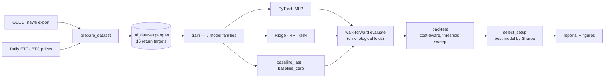

<div align="center">

# Macro News → US Market Returns
### A PyTorch pipeline that asks a hard, honest question about news and markets


**Can daily news signals beat strong baselines at forecasting next-day ETF returns — under evaluation that can't lie to itself?**

*Multi-target regression on 15 ETFs + BTC · walk-forward validation · cost-aware backtesting · a result the model doesn't like*

[Results](#results-summary) · [Pipeline](#how-it-works) · [Run it](#how-to-run) · [Limitations](#limitations) · [Related project](#related-project)

</div>

---

## The honest version, up front

This is a **portfolio research project**, not a trading system, and it's built to prove that on purpose. It's easy to make a news→returns model *look* good — leak a little future information, skip a real baseline, cherry-pick a metric. This project does the opposite: it stacks the deck against itself with a zero-return baseline, chronological walk-forward folds, and per-fold-only preprocessing, then reports what happens even when the answer is unglamorous.

> **The honest headline result:** the PyTorch MLP does edge out every other model on directional accuracy — but at ~49%, that's a coin flip with an asterisk. The **methodology**, not a trading edge, is the point of this repo.

**Why I built it:** I wanted to go past the typical "sentiment score → buy/sell" toy project and build something a quant research team would recognize as rigorous — proper time-ordered evaluation, transaction-cost-aware backtesting, and reporting that doesn't hide the bad numbers.

---

## Highlights

- **6 model families**, including a from-scratch **PyTorch MLP**, benchmarked against Ridge, Random Forest, kNN, and two baselines that are annoyingly hard to beat
- **Walk-forward evaluation** — no shuffling, no random splits; every fold retrains from scratch on strictly past data
- **Cost-aware backtesting** — long-flat / long-short simulation with basis-point trading costs and confidence-threshold sweeps
- **Automated model selection** — best global or per-target setup picked by Sharpe, exported as reproducible CSVs
- **Leakage discipline** — imputation and scaling are fit *inside each fold only*, never on the full dataset
- **Reports that admit failure** — negative R², baseline-beats-MLP-on-RMSE, and other inconvenient results are shown, not filtered out

---

## How it works



One command runs everything downstream of a built dataset:

```bash
python -m news_impact.run_all --data data/processed/ml_dataset.parquet
```

<details>
<summary><b>Module map</b> — what each CLI entry point does</summary>

| CLI module | Role |
|------------|------|
| `news_impact.prepare_dataset` | Merge news + market → Parquet |
| `news_impact.train` | Fit one model family |
| `news_impact.evaluate` | Walk-forward metrics + plots |
| `news_impact.run_all` | Orchestrate train → eval → backtest → selection |
| `news_impact.backtest` | Strategy simulation + threshold grid |
| `news_impact.select_setup` | Pick final operational setup |
| `news_impact.predict` | Inference from saved model or selection file |
| `news_impact.generate_report_figures` | Build all `reports/figures_for_report/` PNGs |

</details>

<details>
<summary><b>What's actually inside the MLP</b> — architecture & training details</summary>

The core neural model (`modeling.py`): `input → Linear(256) → ReLU → Dropout → Linear(256) → ReLU → Dropout → multi-output head`, trained with early stopping.

Reference hyperparameters (`models/mlp/manifest.json`): hidden **256**, dropout **0.1**, lr **0.001**, batch **256**, up to **25** epochs, patience **8**. Features are median-imputed and scaled **inside each training fold only**.

**Walk-forward evaluation:** time-ordered splits, no shuffle. Default quick mode: `wf_start=0.70`, `wf_step=20`, `wf_test_window=60`. Every fold retrains from scratch — no artifact reuse across folds.

**Backtesting:** predictions become long-flat / long-short positions at a configurable transaction cost (default 1 bps), reported as cumulative return, Sharpe, hit rate, and active rate per model/threshold.

**Threshold sweep:** confidence cut-offs `0, 0.0005, 0.001, 0.002, 0.003, 0.005` to test whether filtering weak signals improves Sharpe.

**Selection:** `select_setup` ranks by Sharpe (or cumulative return), globally or per-target, exporting `reports/selection/final_selection_*.csv`.

</details>

---

## Results summary

*Source: committed `reports/metrics/leaderboard.csv`, `reports/summary.md`, `reports/selection/recommended_setups.csv` — walk-forward quick mode.*

<table>
<tr>
<td width="50%">

<br/><sub><b>Global RMSE by model</b> — lower is better. Random Forest and kNN beat the MLP here; the zero baseline wins per-target since most returns are small.</sub>
</td>
<td width="50%">

<br/><sub><b>Directional accuracy</b> — dashed line = 50% (coin flip). The MLP ranks highest among trained models, but stays close to chance.</sub>
</td>
</tr>
<tr>
<td width="50%">

<br/><sub><b>Backtest cumulative return</b> — long-flat @ 1bps, by model/confidence threshold.</sub>
</td>
<td width="50%">

<br/><sub><b>Backtest Sharpe</b> — long-flat @ 1bps. MLP at threshold 0 reaches ≈0.37 Sharpe in this setup.</sub>
</td>
</tr>
</table>

### Forecast metrics (global averages)

| Model | Directional accuracy | RMSE | R² |
|-------|---------------------:|-----:|---:|
| **mlp** | **0.490** | 0.0320 | −13.45 |
| rf | 0.488 | **0.0117** | −0.10 |
| knn | 0.486 | 0.0119 | −0.15 |
| ridge | 0.467 | 0.0359 | −14.21 |
| baseline_last | 0.344 | 0.0152 | −0.80 |
| baseline_zero | 0.008 | 0.0114 | −0.03 |

**Interpretation (honest):** the MLP wins on average directional accuracy but is close to random; `baseline_zero` wins on RMSE for all 15 targets because most returns are small; several models post negative R² on average, meaning point forecasts are often worse than just predicting the mean.

### Backtest (1 bps, from `recommended_setups.csv`)

| Scope | Setup | Sharpe |
|-------|--------|-------:|
| Global | mlp · thr=0 · long_flat | 0.37 |
| Per-target (avg of bests) | mixed models | 1.18 |

These are simple research backtests on held-out predictions — useful for comparing models, **not** evidence of a deployable strategy.

<details>
<summary><b>Regenerate the full figure set (18+ plots)</b></summary>

The images above are the subset committed to `assets/` for GitHub rendering. The full set lives under `reports/figures_for_report/` (gitignored — regenerate locally after a run):

```bash
pip install -e .
python -m news_impact.generate_report_figures   # after reports/metrics/ exists from run_all
```

Index and captions: `reports/figures_for_report/FIGURE_INDEX.md`.

</details>

---

## Technical stack

| Layer | Technology |
|-------|------------|
| Language | Python 3.10+ |
| Deep learning | **PyTorch** (MLP regressor, custom training loop) |
| Classical ML | scikit-learn (kNN, Ridge, Random Forest, imputation, scaling) |
| Data | pandas, NumPy, Parquet |
| News parsing | Custom GDELT helpers (`V2Tone`, hashed themes/orgs) |
| Markets | yfinance-exported daily prices |
| Viz | matplotlib |
| Packaging | `pyproject.toml`, `pip install -e .` |

---

## Data preparation

1. **News** — parse GDELT export: daily tone stats (pos/neg/polarity), article count, hashed theme and organisation features (`FeatureHasher`, 256 dims each).
2. **Market** — align daily prices; compute next-day returns per ticker (15 assets: UUP, TLT, GLD, BTC-USD, and US sector ETFs XLK … XLC).
3. **Merge** — inner join on calendar date; drop rows with missing targets where needed.
4. **Output** — `data/processed/ml_dataset.parquet` (~1.8k rows, 543 columns in the reference run).

Raw CSVs are not committed to the repo — see [How to run](#how-to-run).

---

## How to run

```bash
python -m venv .venv
.\.venv\Scripts\activate          # Windows
pip install -r requirements.txt
pip install -e .
```

**1. Provide raw data locally**

| File | Description |
|------|-------------|
| `data/raw/dataset.csv` | Filtered GDELT / news export |
| `data/raw/market_data.csv` | Daily prices (yfinance export) |

**2. Build the dataset**

```bash
python -m news_impact.prepare_dataset \
  --news data/raw/dataset.csv \
  --market data/raw/market_data.csv \
  --out data/processed/ml_dataset.parquet
```

**3. Run the full pipeline**

```bash
python -m news_impact.run_all --data data/processed/ml_dataset.parquet          # quick mode
python -m news_impact.run_all --data data/processed/ml_dataset.parquet --mode full
```

<details>
<summary><b>Optional: backtest, selection, and figures individually</b></summary>

```bash
python -m news_impact.backtest --reports-dir reports --cost-bps 1.0 \
  --thresholds 0,0.0005,0.001,0.002,0.003,0.005

python -m news_impact.select_setup --reports-dir reports --objective sharpe \
  --cost-bps 1 --scope per-target

python -m news_impact.generate_report_figures
```

Read `reports/summary.md` after a run for the latest leaderboard and diagnostics.

</details>

<details>
<summary><b>Repository structure</b></summary>

```
news_impact_nn_project/
├── src/news_impact/           # Pipeline source code
│   ├── prepare_dataset.py
│   ├── modeling.py            # MLPRegressor (PyTorch)
│   ├── train.py / evaluate.py
│   ├── run_all.py
│   ├── backtest.py
│   └── select_setup.py
├── assets/                    # README figures (subset of report output)
├── data/raw/                  # User inputs (gitignored)
├── data/processed/            # ml_dataset.parquet (gitignored)
├── models/                    # Trained weights (gitignored)
├── reports/
│   ├── metrics/               # CSV results (in repo)
│   ├── selection/             # Final setups (in repo)
│   ├── summary.md             # Auto-generated run summary
│   └── figures_for_report/    # Full figure set (gitignored; regenerate locally)
├── requirements.txt
└── pyproject.toml
```

</details>

---

## Limitations

- **Weak average signal** — directional accuracy ≈ 50%; no strong evidence of consistent edge.
- **Negative R²** for several models on MSE-based scoring.
- **Simplified backtest** — no realistic execution, capacity, or borrow costs beyond flat bps.
- **News filter dependency** — results depend on GDELT export scope and date range (~2021–2026 in reference manifest).
- **Research scope** — not production-ready; no live ingestion, monitoring, or risk system.
- **Classical models often beat MLP on RMSE** — the neural net is the core ANN contribution, not the metric leader on every axis.

## Future improvements

- News embeddings (transformers) instead of hashed bag-of-themes
- Purged cross-validation with embargo for overlapping features
- Probabilistic / quantile forecasts with proper scoring rules
- Shared-encoder multi-task architecture across the 15 targets
- Experiment tracking (MLflow) and hyperparameter search
- Subperiod stability and regime-conditional evaluation

---

## Related project

This forecasting pipeline is one half of my BSc final year project. The other half — **[mandate-investor-profiling-fyp](https://github.com/adro0303/mandate-investor-profiling-fyp)** — takes a different angle on the same problem space: instead of forecasting *returns*, it profiles investors by mandate and builds regime-aware ETF allocations. Same research context, deliberately different question.

---

<sub>Development was done primarily locally before this repo was organised for public portfolio use — the visible history is a clean export of source, metrics, and selected figures, not a full lab notebook. New work lands as normal incremental commits from here.</sub>

<div align="center">

**Adrián** — Software / AI Developer, building things with code.
Demonstrates Python ML engineering, PyTorch, time-series evaluation, and honest experiment reporting.

[](https://github.com/adro0303)

</div>
